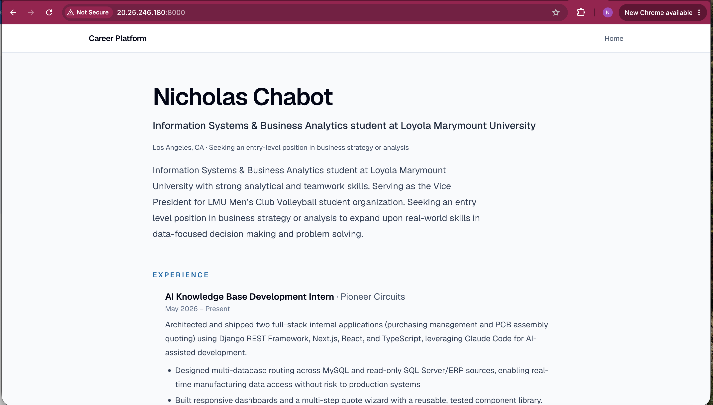

# Exercise 03 Evidence

## Virtual machine

| Property | Value |
| --- | --- |
| Name | `vm-career-platform` |
| Resource group | `rg-career-platform` |
| Region | North Central US (`northcentralus`) |
| Size | Standard B2ats v2 (`Standard_B2ats_v2`): 2 vCPUs, 1 GiB memory |
| Public IP address | `20.25.246.180` |

## Site running on the VM

The career platform served from the VM at `http://20.25.246.180:8000`.

## What went wrong and how I fixed it

### Region not allowed by the subscription

**What went wrong:** I tried to create the VM in US West, but Azure refused
the deployment. My Azure for Students subscription only allows certain regions.

**How I investigated:** Using Claude Code, I listed the policies assigned to my
subscription with `az policy assignment list`. It has an "Allowed resource
deployment regions" policy that permits only `swedencentral`, `northcentralus`,
`francecentral`, `belgiumcentral`, and `canadacentral`. US West isn't on the
list.

**What confirmed the fix:** I created the VM in North Central US instead.
`az vm show -d -g rg-career-platform -n vm-career-platform` reports
`northcentralus` and `VM running`.

### My migration plan listed my laptop's IP as the VM's

**What went wrong:** My migration plan gave the VM's public IP as an address
that turned out to be my laptop's own public IP. Every SSH and `scp` step would
have pointed at the wrong machine.

**How I investigated:** Using Claude Code, I looked up my laptop's public IP
with two services (ipify and ifconfig.me). Both returned the address I had
listed for the VM. `az vm show -d` reported the VM's actual public IP as
`20.25.246.180`.

**What confirmed the fix:** I updated the plan to use the VM's address. A test
connection, `ssh -o BatchMode=yes azureuser@20.25.246.180 'echo connected'`,
printed `connected`.

### The SQLite database I expected didn't exist

**What went wrong:** I expected the app to use a SQLite database file, such as
`career_platform.db`, but no database file existed. Later, I thought the
database held a demo profile created by a seed script, but it was actually
empty.

**How I investigated:** Using Claude Code, I searched my computer and the
project's full history for a database file and found none. The code showed the
app was set up for a different kind of database (PostgreSQL), not a SQLite
file. When I checked again later, every table in the database had 0 rows.

**What confirmed the fix:** Using Claude Code, I switched the app to SQLite.
Running `pnpm db:migrate` created `data/career_platform.db` with all 12 tables,
and the app's tests passed against it. I then added my resume data, and the row
counts showed profile 1, experience 2, education 2, project 1, and skill 4.

## The change

**Scenario:** I'm at a coffee shop and try to SSH into my VM to fix a typo. The
command hangs.

**What breaks:** The firewall rule on my VM's network security group only allows
SSH from my laptop's /32 address. The coffee shop gives me a different public
IP from the one where that rule was created, so Azure drops the connection.

**What I would do:** I would first check in the portal that the VM is running.
If it is, I would look up my new public IP, by running `curl ifconfig.me` in the
terminal or visiting ifconfig.me in Chrome. Then I would change the
`Allow-SSH-Laptop` rule's source to the new IP address (with /32), rather than
changing it to Any.

**What it costs:** Several minutes, plus the fact that I will need to change the
rule again later. Everyone at the coffee shop is on the same Wi-Fi that shares
the address, so they could reach my SSH port, too, but cannot do so without my
private key.
